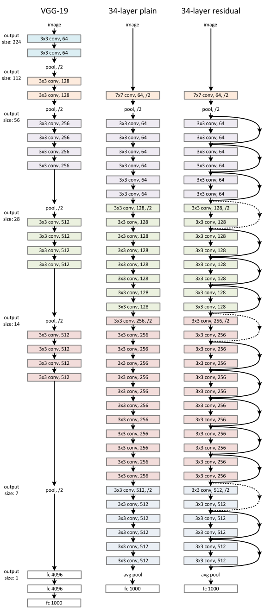
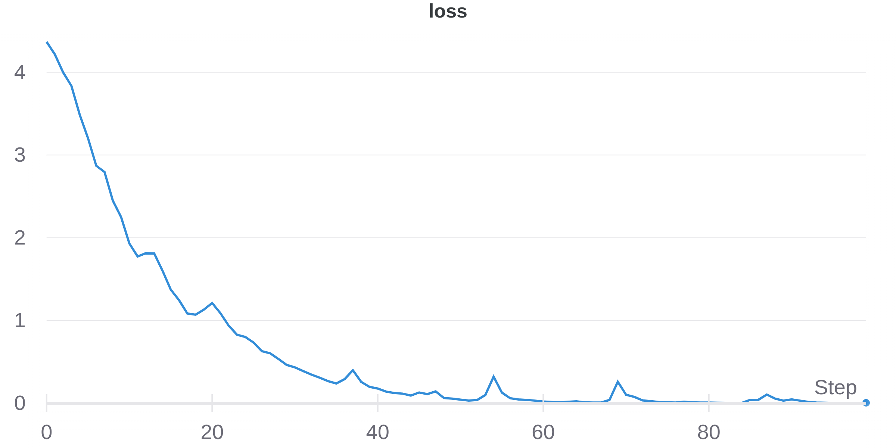
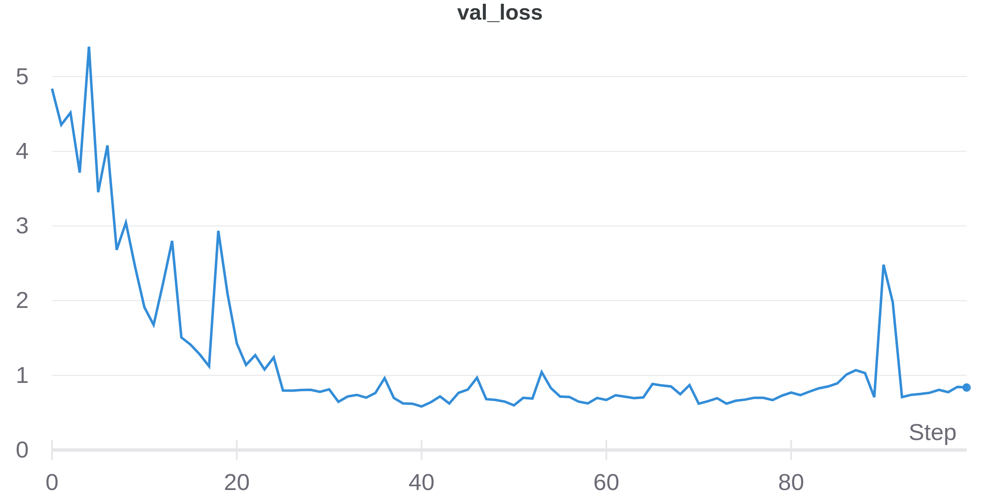
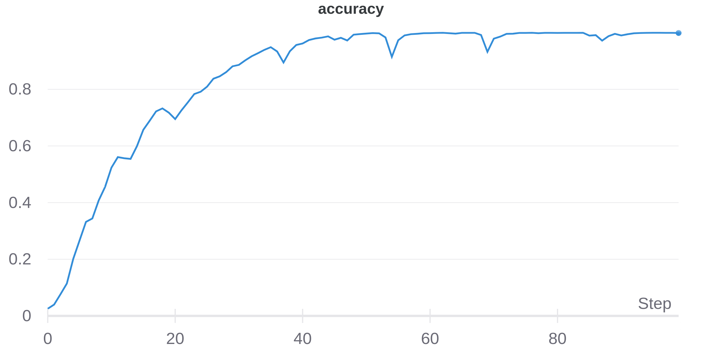
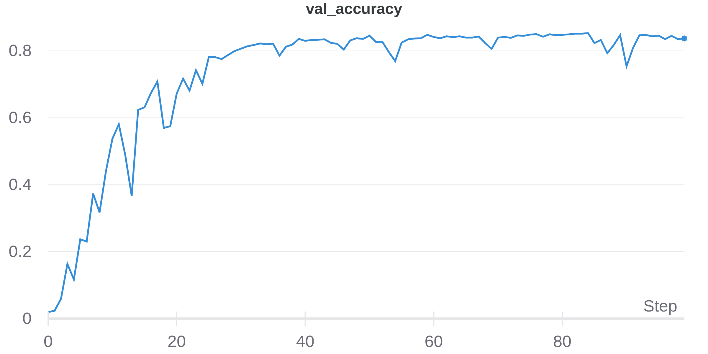

# OCRDeepLearning
Character Recognition in Natural Images with Convolutional Neural Networks

This repository provides a trained model. The model used is ResNet50 with classifier for the 62 classes of the dataset. The trained model was initialized with imagenet weights. 

Keras was used as the DCNN framework.

## Dataset

The dataset used is available in the repository of the Center for Vision, Speech and Signal Processing at the University of Surrey.

- [The Chars 74k Dataset](http://www.ee.surrey.ac.uk/CVSSP/demos/chars74k/)

The dataset folder must be extracted from the 'English' folder at the project root.

## Training scheme

### Data augmentation

Dataset contains 7705 images, resized to 64x64. To improve the generalization of the network, rotation, contrast change and flip operations were applied.

### Model

ResNet 50 (Figure 1) with top layer modified to 62 classes was used. 

Figure 1: 34 layer ResNet model (on the right). Fonte: [1].

The model is freely available in the repository.

### Training results

The model was trained with 100 epochs, with Adam optimizer. 

Loss and accuracy is shown below.

The model performed 83.71% for validation accuracy after training. With further training, the accuracy is expected to reach even better results.

---

## How to train and test

Feel free to train the model from scratch or fine tune it.

### Dependencies

- Keras>=2.6.0
- Matplotlib>=3.4.3
- Numpy
- Pillow>=8.3.1
- Tensorflow>=2.6.0

### Train

Modify any hyperparameter in train.py and run it. The resulting model will be at 'saved/model/model_new.h5'.

### Test

The available test.py script expects an '-img' parameter which must contain the rest of the path of the image to test from 'English/Img/GoodImg/Bmp'. An example of execution is shown below.

- python test.py -img /Sample008/img008-00019.png

This execution will output 'Sample008', which is the expected class for the considered sample. Keep in mind that 'Sample001' represents the class for the number 0, so 'Sample008' represents the class for the number 7.

## References

[1] He, K., Zhang, X., Ren, S., & Sun, J. (2016). Deep residual learning for image recognition. In Proceedings of the IEEE conference on computer vision and pattern recognition (pp. 770-778).
